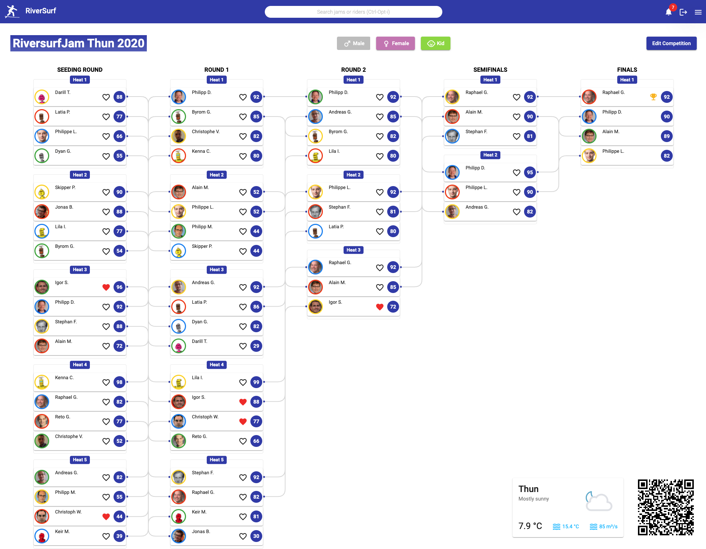

# riversurf-angular

Angular frontend for RiverSurf.app.

*"Plan, keep track and stay up to date at river surf events."*

Team:

* Alain Messerli @messa4
* Igor Stojanovic @stoji2
* Marius Stalder @stalm12
* Raphael Gerber @gerbr19

## Live Demo

You can visit the application at [https://test.riversurf.app](https://test.riversurf.app).

## Administrator Access

[Login](https://test.riversurf.app/login) with Username: `fritz32`, Password: `123456789`.

## Installation

Clone the repository: `git clone https://gitlab.ti.bfh.ch/aligmara/riversurf-angular.git`.

Run `npm ci` to install all required modules.

Run `npm start` or `ng serve` and navigate to [http://localhost:4200](http://localhost:4200).

## Build

Run `npm run build` or `ng build` to build the project. The build artifacts will be stored in the `dist/` directory. Use the `--prod` flag for a production build.

## Progressive Web App (PWA)

To test the PWA locally, you need to **build** the project. Furthermore, you need to install an HTTP-Server, e.g. by running `npm install http-server -g`.

After that, you need to serve the build by running `http-server -p <desired-port-number>`.

You can then navigate to [http://localhost:<desired-port-number>](http://localhost:<desired-port-number>).

## Documentation

The detailed documentation can be found in our [Wiki](https://gitlab.ti.bfh.ch/aligmara/riversurf-angular/-/wikis/home).
